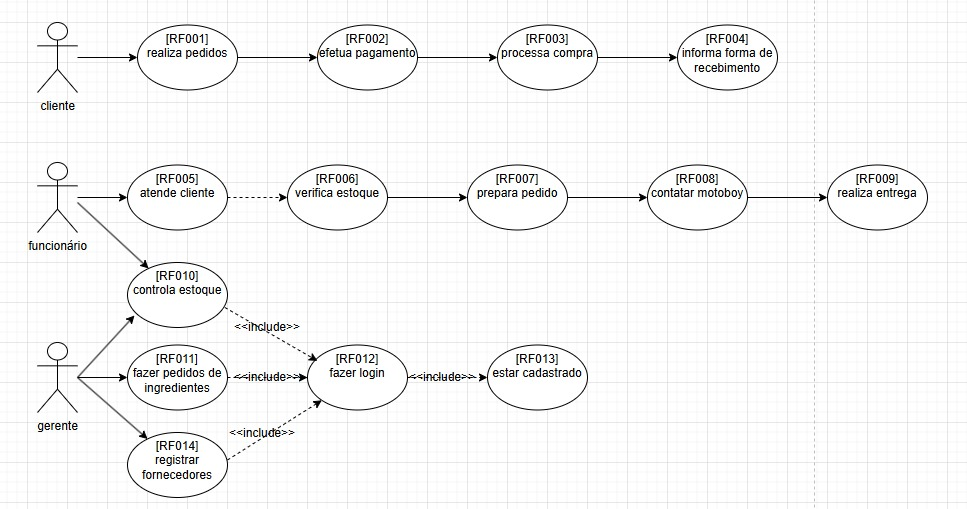
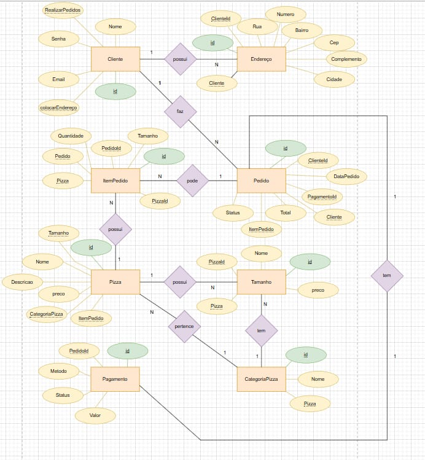
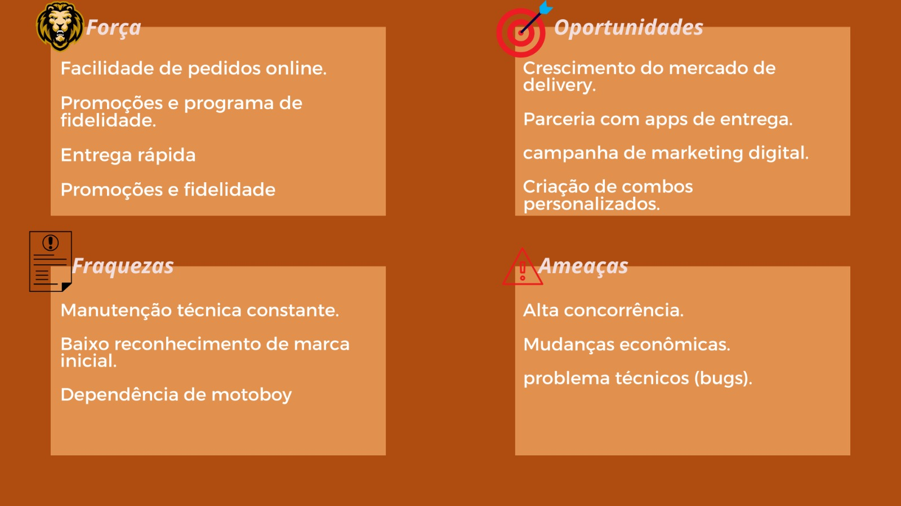

## Backlog do Projeto final
#### Sprint inicial
- [x] Escolher a metodologia **SCRUM, KANBAN, XP, outras**
- [x] Definir **Papéis e responsabilidades**
- [x] Apresentar a proposta inicial
#### Sprint atual
- [x] Modelar o negócio no **[Canvas](https://wellifabio.github.io/canvas/)**
- [x] Criar um cronograma **[Gráfico Gant](https://wellifabio.github.io/gantt/)**
- [x] Criar um repositório no **github** com o nome do projeto ou tcc-nomeprojeto e adicionar os integrantes do grupo como colaboradores.
    - Acrescentar um README.md com **link** para todas as **entregas**
    - Poderá criar outros repositórios separados para back-end, front-end, mobile, etc porém todos os links devem estar no README do repositório principal
    - Todo o documental do projeto, diagramas, wireframes e documento do projeto ABNT devem estar em uma pasta chamada **./docs**
- [x] **Protótipo** funcional inicial (Com Figma - Mobile e Web))
    - [ ] Web
    - [x] Mobile
- [ ] Elencar os **[requisitos funcionais como neste exemplo](./requisitos.md)**.
- [x] Modelar o banco de dados MER x DER Modelo conceitual
- [x] Cadastrar os integrantes do grupo nas ferramentas de gestão de projeto escolhida Trello, Jira, Asana, etc.
#### Próxima Sprint
- [ ] [DC (Diagrama de Classes)](https://github.com/wellifabio/senai2024/tree/main/ds/3des/03-rms/aula03) Back-End
- [ ] Iniciar a codificação/desenvolvimento **Banco de dados**
- [ ] Iniciar a codificação/desenvolvimento **Back-end**
- [ ] Iniciar a codificação/desenvolvimento **Front-end**
- [ ] Iniciar a codificação/desenvolvimento **Mobile**

# Documentação

## DCU

## DER

## SWOT

## Requisitos funcionais

RF01 - Gerenciamento de Clientes: O sistema deve permitir cadastrar, editar, listar e excluir clientes (nome, email, telefone, endereço, senha).
RF02 - Gerenciamento de Produtos: O sistema deve permitir cadastrar, editar, listar e excluir produtos (nome, preço, imagem).
RF03 - Gerenciamento de Pedidos: O sistema deve permitir criar pedidos, listar e excluir, associando itens a clientes.
RF04 - Gerenciamento de Itens: O sistema deve permitir adicionar itens a pedidos (quantidade, preço unitário).
RF05 - Gerenciamento de Reservas: O sistema deve permitir criar, editar, listar e excluir reservas (data, hora, número de pessoas, status).
RF06 - Carrinho de Compras: O sistema deve permitir adicionar produtos ao carrinho, ajustar quantidades e finalizar pedidos com opções de pagamento (Pix, Cartão, Boleto, Débito).
RF07 - Autenticação: O sistema deve autenticar clientes via login com token JWT.
RF08 - Integração: O frontend deve se comunicar com o backend via API REST.

##Requisitos Não Funcionais

RNF01 - Desempenho: O sistema deve responder a requisições em até 2 segundos.
RNF02 - Escalabilidade: O sistema deve suportar até 100 usuários simultâneos.
RNF03 - Segurança: O sistema deve usar HTTPS e criptografar senhas com hash (ex.: bcrypt).
RNF04 - Usabilidade: O frontend deve ser responsivo (desktop, tablet, celular) com design intuitivo.
RNF05 - Disponibilidade: O sistema deve ter 99% de uptime.
RNF06 - Manutenção: O código deve ser documentado e modular para facilitar atualizações

